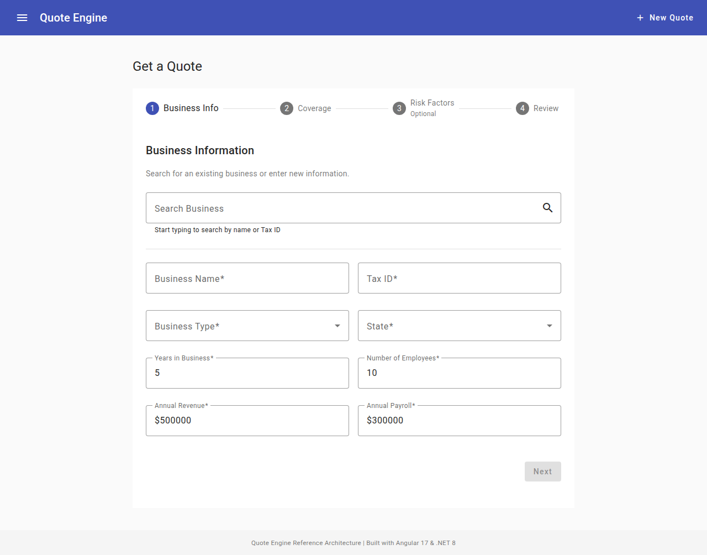
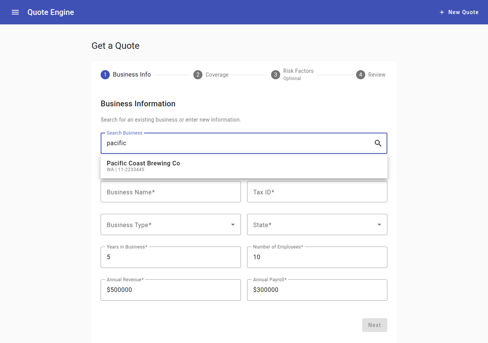
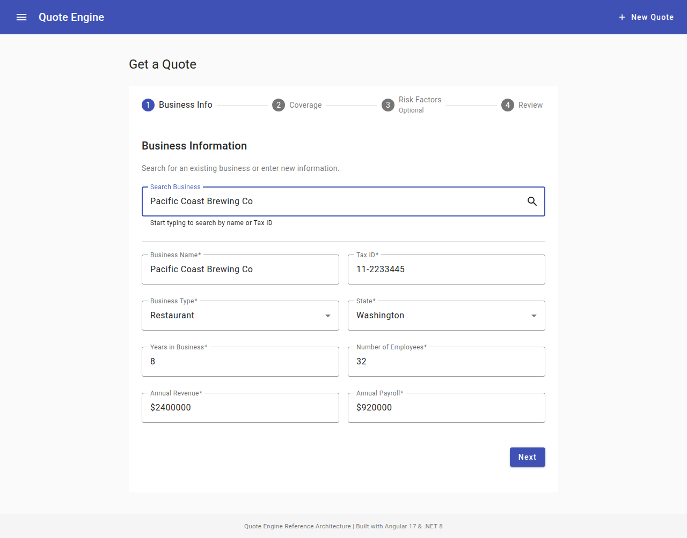
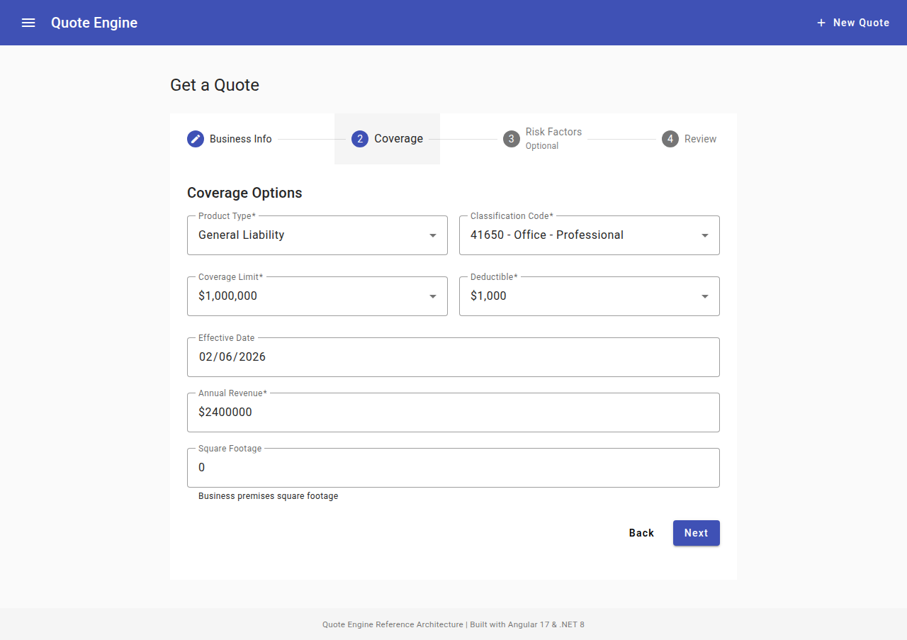
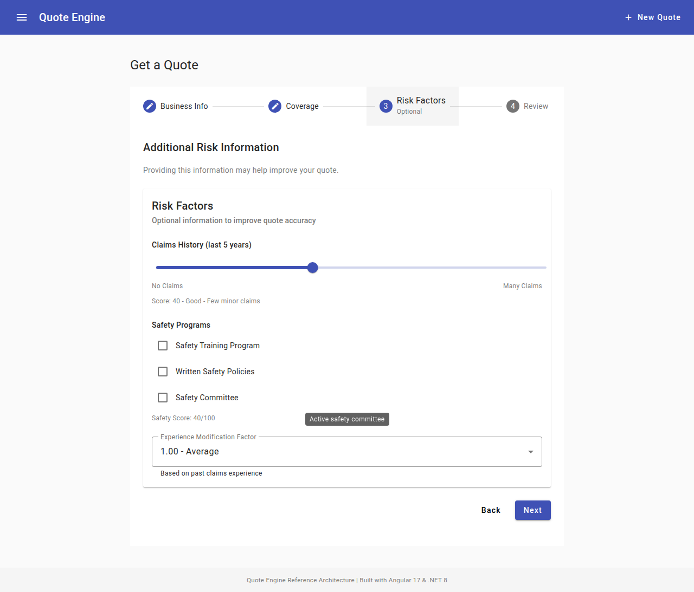
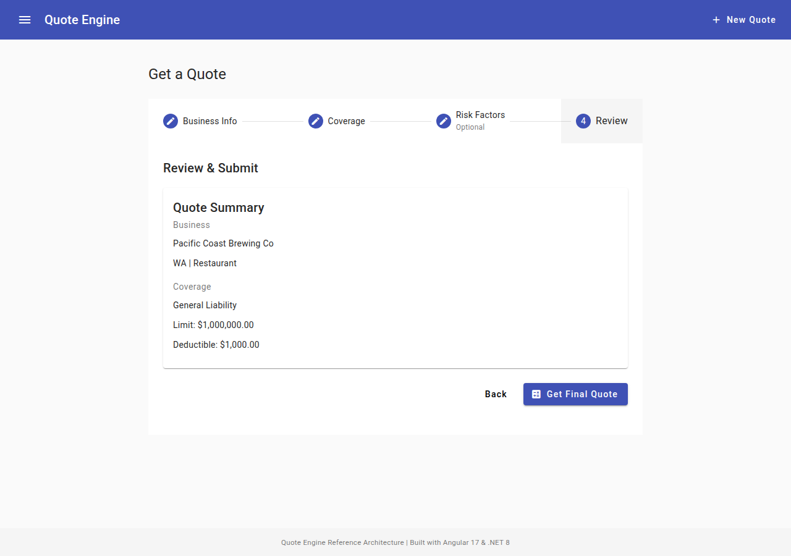
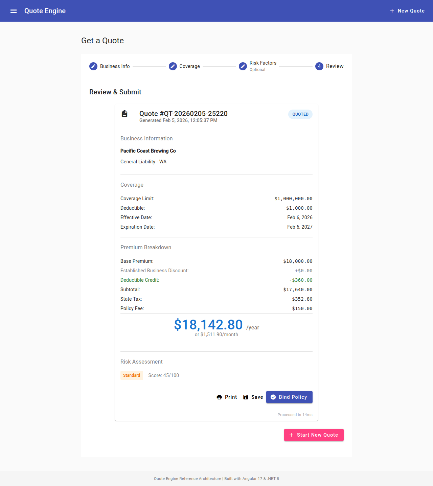

# Quote Engine Reference Architecture

[](https://github.com/fchchen/quote-engine-reference-architecture/actions/workflows/ci.yml)

A production-ready reference architecture for building scalable, real-time commercial insurance quoting platforms. Demonstrates high-throughput API design, async processing patterns, and financial transaction integrity using .NET Core, SQL Server, and Azure Functions.

## Architecture Overview

```
┌─────────────────────────────────────────────────────────────────────────┐
│                          Angular 17 Frontend                              │
│  ┌─────────────┐  ┌─────────────┐  ┌─────────────┐  ┌─────────────────┐ │
│  │ Quote Form  │  │Quote Result │  │  Business   │  │  Quote History  │ │
│  │  (Stepper)  │  │  Display    │  │   Search    │  │    (Table)      │ │
│  └──────┬──────┘  └──────┬──────┘  └──────┬──────┘  └────────┬────────┘ │
│         │                │                │                  │          │
│  ┌──────┴────────────────┴────────────────┴──────────────────┴────────┐ │
│  │                    Services (Signals + RxJS)                        │ │
│  │  • QuoteService (state management)                                  │ │
│  │  • BusinessLookupService (search with debounce)                     │ │
│  │  • RateTableService (cached reference data)                         │ │
│  └──────────────────────────────┬──────────────────────────────────────┘ │
└─────────────────────────────────┼───────────────────────────────────────┘
                                  │ HTTP
                                  ▼
┌─────────────────────────────────────────────────────────────────────────┐
│                         .NET 8 Web API                                   │
│  ┌─────────────────┐  ┌─────────────────┐  ┌─────────────────────────┐  │
│  │ QuoteController │  │BusinessController│  │  RateTableController   │  │
│  └────────┬────────┘  └────────┬────────┘  └────────────┬────────────┘  │
│           │                    │                        │               │
│  ┌────────┴────────────────────┴────────────────────────┴────────────┐  │
│  │                         Services Layer                             │  │
│  │  ┌─────────────┐  ┌────────────────┐  ┌───────────────────────┐   │  │
│  │  │QuoteService │  │ RiskCalculator │  │ InMemoryRateTableSvc  │   │  │
│  │  │ (business   │  │ (premium calc) │  │ (demo data)           │   │  │
│  │  │  logic)     │  │                │  │                       │   │  │
│  │  └─────────────┘  └────────────────┘  └───────────────────────┘   │  │
│  └───────────────────────────────────────────────────────────────────┘  │
│           │                                                             │
│  ┌────────┴──────────────────────────────────────────────────────────┐  │
│  │                      Data Layer (EF Core)                          │  │
│  │  QuoteDbContext  │  Repositories  │  Entities                      │  │
│  └────────────────────────────────────────────────────────────────────┘  │
└─────────────────────────────────────────────────────────────────────────┘
                                  │
                                  ▼
┌─────────────────────────────────────────────────────────────────────────┐
│                      SQL Server Express (Local)                          │
│  ┌──────────┐  ┌────────┐  ┌───────────┐  ┌────────┐  ┌───────────┐    │
│  │Businesses│  │ Quotes │  │ RateTables│  │Policies│  │ AuditLog  │    │
│  └──────────┘  └────────┘  └───────────┘  └────────┘  └───────────┘    │
└─────────────────────────────────────────────────────────────────────────┘

         OR (Azure Deployment - Free Tier)

┌─────────────────────────────────────────────────────────────────────────┐
│                      Azure Static Web Apps                               │
│                      (Angular Frontend)                                  │
└────────────────────────────┬────────────────────────────────────────────┘
                             │ HTTP (/api/v1)
                             ▼
┌─────────────────────────────────────────────────────────────────────────┐
│                Azure App Service (Linux, Free Tier)                       │
│  ┌─────────────────┐  ┌─────────────────┐  ┌─────────────────────────┐  │
│  │ QuoteController │  │BusinessController│  │  RateTableController   │  │
│  └────────┬────────┘  └────────┬────────┘  └────────────┬────────────┘  │
│           │                    │                        │               │
│  ┌────────┴────────────────────┴────────────────────────┴────────────┐  │
│  │                    Services Layer                                   │  │
│  │  InMemoryDataServices (no SQL cost) or Azure SQL (optional)        │  │
│  └───────────────────────────────────────────────────────────────────┘  │
└─────────────────────────────────────────────────────────────────────────┘
```

## Key Features

- **Signal-First State Management**: Angular 17+ signals for reactive UI state
- **Real-Time Premium Calculation**: Instant quote generation with premium breakdown
- **RESTful API Design**: Versioned endpoints with proper HTTP semantics
- **Dependency Injection**: Loose coupling for testability and flexibility
- **Clean Architecture**: Separation of concerns across layers
- **Free Tier Azure Deployment**: Static Web Apps + App Service with zero-cost in-memory data

## User Journey

### Step 1: Business Search & Selection

Search for an existing business by name or Tax ID with autocomplete results:





Selecting a business auto-populates all form fields:



### Step 2: Coverage Options

Configure product type, classification code, coverage limits, and deductible:



### Step 3: Risk Factors (Optional)

Adjust claims history, safety programs, and experience modification factor:



### Step 4: Review & Quote Result

Review the quote summary and submit to get a real-time premium calculation:



The final quote shows a full premium breakdown with base premium, discounts, taxes, and risk assessment:



## Tech Stack

| Layer | Technology | Purpose |
|-------|------------|---------|
| Frontend | Angular 17+ | UI with signals, Material Design |
| Backend | .NET 8 | RESTful API with DI |
| Database | SQL Server Express | Local development |
| Hosting | Azure Static Web Apps + App Service | Free tier deployment |
| ORM | Entity Framework Core 8 | Data access |
| Testing | xUnit + Moq + Playwright | Unit, integration, and E2E tests |

## Quick Start

### Prerequisites

- .NET 8 SDK
- Node.js 18+
- SQL Server Express (optional, for local DB)
- Azure Functions Core Tools (optional, for Functions development)

### Local Development

1. **Clone the repository**
   ```bash
   git clone https://github.com/your-org/QuoteEngine-Reference-Architecture.git
   cd QuoteEngine-Reference-Architecture
   ```

2. **Run the .NET API**
   ```bash
   cd src/QuoteEngine.Api
   dotnet run
   ```
   API will be available at `http://localhost:5210`

3. **Run the Angular frontend**
   ```bash
   cd client
   npm install
   npm start
   ```
   Frontend will be available at `http://localhost:4200`

4. **(Optional) Set up SQL Server**
   ```bash
   # Run schema script
   sqlcmd -S localhost\SQLEXPRESS -i database/schema.sql
   # Run seed data
   sqlcmd -S localhost\SQLEXPRESS -i database/seed-data.sql
   ```

### Azure Functions (Free Tier)

```bash
cd src/QuoteEngine.Functions
func start
```
Functions will be available at `http://localhost:7071`

### Azure Deployment

The project is deployed to Azure on the free tier:

| Component | URL |
|-----------|-----|
| API | https://quote-engine-api.azurewebsites.net/api/v1 |
| Frontend | https://lively-coast-0804ea410.6.azurestaticapps.net |

**CI/CD**: GitHub Actions runs .NET tests, Angular build, and Playwright E2E on every push/PR. Azure deployment is triggered manually via the "Run workflow" button in GitHub Actions.

**Required GitHub Secrets**:
- `AZURE_CREDENTIALS` — service principal JSON for Azure App Service deployment
- `AZURE_STATIC_WEB_APPS_API_TOKEN` — deployment token for Azure Static Web Apps

**Feature toggle**: When an Azure SQL connection string is present, the API uses Azure SQL; when absent, it falls back to in-memory data services (zero-cost demo).

## Project Structure

```
QuoteEngine-Reference-Architecture/
├── README.md                           # This file
├── docs/
│   ├── architecture-overview.md        # System design
│   ├── dotnet-patterns.md              # .NET best practices
│   ├── sql-optimization.md             # Database tuning
│   └── azure-deployment.md             # Deployment guide
├── src/
│   ├── QuoteEngine.Api/                # .NET Core Web API
│   ├── QuoteEngine.Functions/          # Azure Functions
│   ├── QuoteEngine.Data/               # EF Core data layer
│   └── QuoteEngine.Tests/              # Unit tests
├── client/                             # Angular 17+ frontend
├── database/                           # SQL scripts
└── deploy/                             # Deployment configurations
```

## Interview-Relevant Topics

This project demonstrates proficiency in:

### .NET Core
- Dependency Injection lifetimes (Singleton/Scoped/Transient)
- Async/Await patterns with CancellationToken
- Middleware pipeline configuration
- LINQ queries and expressions

### SQL Server
- Index design (Clustered vs Non-clustered)
- Finding and deleting duplicates
- Query optimization with execution plans
- Transaction handling (ACID compliance)

### Angular 17+
- Signals for state management
- Standalone components
- Functional interceptors and guards
- RxJS integration (debounce, switchMap)

### System Design
- RESTful API versioning
- Service layer patterns
- Repository pattern
- Clean architecture

## Sample API Calls

```bash
# Create a quote
curl -X POST http://localhost:5210/api/v1/quote \
  -H "Content-Type: application/json" \
  -d '{
    "businessName": "Test Business LLC",
    "taxId": "12-3456789",
    "businessType": "Technology",
    "stateCode": "CA",
    "productType": "GeneralLiability",
    "annualRevenue": 1000000,
    "annualPayroll": 500000,
    "employeeCount": 10,
    "yearsInBusiness": 5,
    "coverageLimit": 1000000,
    "deductible": 1000
  }'

# Get a quote
curl http://localhost:5210/api/v1/quote/QT-20240101-12345

# Search businesses
curl "http://localhost:5210/api/v1/business/search?searchTerm=Tech&stateCode=CA"

# Get classification codes
curl http://localhost:5210/api/v1/ratetable/classifications/GeneralLiability
```

## Testing

```bash
# Run .NET tests
cd src/QuoteEngine.Tests
dotnet test

# Run Angular tests
cd client
npm test
```

## Documentation

- [Architecture Overview](docs/architecture-overview.md)
- [.NET Patterns Guide](docs/dotnet-patterns.md)
- [SQL Optimization Guide](docs/sql-optimization.md)
- [Azure Deployment Guide](docs/azure-deployment.md)

## License

MIT License - See LICENSE file for details.

---

**Note**: This is a reference architecture for educational and demonstration purposes. It is designed to showcase best practices and patterns without containing any proprietary business logic or company-specific implementations.
